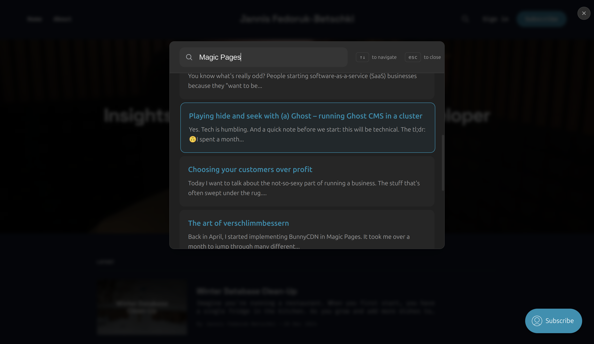

# @magicpages/ghost-typesense-search-ui

A beautiful, accessible search interface for Ghost blogs using Typesense. Built with vanilla JavaScript.



## Features

- 🔍 Real-time search with Typesense
- 🎨 Beautiful, accessible interface
- 🌓 Automatic dark mode
- ⌨️ Full keyboard navigation
- 📱 Responsive design
- 🎯 Common searches support

## Installation

### Option 1: Replace Ghost's `sodoSearch` (Recommended if you can edit your config)

Add to your `config.[environment].json`:
```json
"sodoSearch": {
    "url": "[link to search.min.js]"
}
```

Or set environment variable:
```bash
sodoSearch__url=[link to search.min.js]
```

### Option 2: Direct Installation (Works if you can't edit your config, e.g. on Ghost(Pro))

Add to your site's code injection:

```html

<script src="https://unpkg.com/@magicpages/ghost-typesense-search-ui/dist/search.min.js"></script>
```

The script automatically takes over Ghost's native search and works with the `/#/search` URL trigger.

## Configuration

| Option | Type | Required | Description |
|--------|------|----------|-------------|
| `typesenseNodes` | `Array` | Yes | Typesense node configurations |
| `typesenseApiKey` | `String` | Yes | Search-only API key |
| `collectionName` | `String` | Yes | Collection name |
| `theme` | `String` | No | 'light', 'dark', or 'system' |
| `commonSearches` | `Array` | No | Common search terms |
| `searchFields` | `Object` | No | Field weights and highlighting |

## Keyboard Shortcuts

- `/`: Open search
- `↑/↓`: Navigate results
- `Enter`: Select result
- `Esc`: Close search

## Customization

The UI uses CSS variables for styling:

```css
#mp-search-wrapper {
  --modal-bg: #fff;
  --text-primary: #333;
  --text-secondary: #666;
  --border-color: rgba(0, 0, 0, 0.1);
  --hover-bg: rgba(0, 0, 0, 0.05);
  --backdrop-color: rgba(0, 0, 0, 0.5);
  --accent-color: var(--ghost-accent-color, #1c1c1c);
}

/* Dark mode */
#mp-search-wrapper.dark {
  --modal-bg: #1c1c1c;
  --text-primary: #fff;
  --text-secondary: #999;
  --border-color: rgba(255, 255, 255, 0.1);
  --hover-bg: rgba(255, 255, 255, 0.05);
}
```

## License

MIT © [MagicPages](https://www.magicpages.co) 